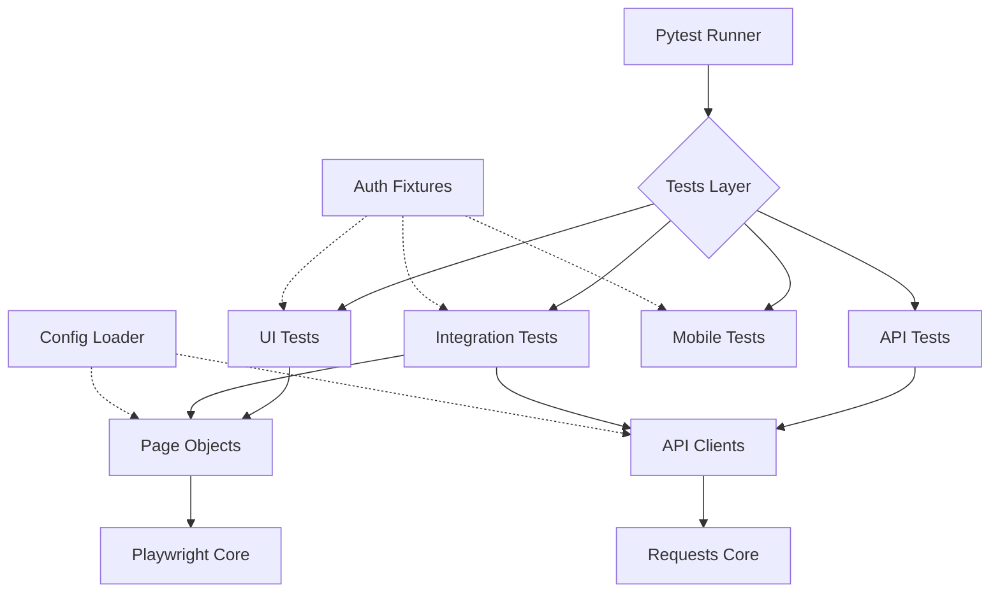

# Part 2: Test Framework Design

This document outlines the test automation framework design for the B2B SaaS platform, addressing the given requirements (Web/Mobile support, Multi-tenant, Role-based auth, API, BrowserStack, and CI/CD).

## 1. Framework Structure

The framework is built using **Python, Pytest, and Playwright**. It follows a hybrid Page Object Model (POM) and API Client abstraction approach.

### Folder Structure

```text
qa-automation/
├── ci/
│   └── pipeline.yml                # CI/CD workflows (GitHub Actions/GitLab)
├── config/
│   ├── environments.yaml           # Environment URLs (dev, staging, prod)
│   ├── tenants.yaml                # Tenant specific configs (subdomains)
│   └── browserstack.yaml           # BrowserStack cross-platform capabilities
├── src/
│   ├── api/                        # API client layer
│   │   ├── base_client.py          # Requests/Retries/Auth handling
│   │   └── project_client.py       # Domain-specific API methods
│   ├── fixtures/                   # Pytest fixtures
│   │   ├── auth_fixtures.py        # Role-based storage state (Admin, Manager, Employee)
│   │   └── data_fixtures.py        # Setup/Teardown for test data (e.g. projects)
│   ├── pages/                      # Page Object Model (POM)
│   │   ├── base_page.py            # Common UI interactions
│   │   ├── login_page.py           
│   │   └── dashboard_page.py
│   └── utils/
│       └── data_generator.py       # Dynamic test data (UUIDs, Faker)
├── tests/
│   ├── api/                        # Pure backend API tests
│   ├── integration/                # API-to-UI flow tests
│   ├── mobile/                     # Mobile-specific tests via BrowserStack
│   └── ui/                         # Desktop Web UI tests
├── conftest.py                     # Global pytest fixtures and plugin configurations
├── pytest.ini                      # Pytest markers and default options
└── requirements.txt                # Python dependencies
```

### Component Diagram (Mermaid)



### Base Classes and Utilities (Pseudocode)

**Base Page Object:** Handles common resilient interactions.
```python
class BasePage:
    def __init__(self, page):
        self.page = page

    def wait_and_click(self, locator: str):
        self.page.locator(locator).wait_for(state="visible")
        self.page.locator(locator).click()
```

**Base API Client:** Handles retries, headers, and standard response validation.
```python
class BaseAPIClient:
    def __init__(self, base_url, token, tenant_id):
        self.headers = {'Authorization': f'Bearer {token}', 'X-Tenant-ID': tenant_id}

    def request(self, method, path, retries=3):
        # Implementation with exponential backoff on 5xx errors
        pass
```

---

## 2. Configuration Management

Handling multiple dimensions (environments, tenants, browsers) requires externalizing configuration from the code.

### Environments and Tenants
We load YAML configurations at runtime via a `config_loader.py` utility. The target environment is specified via a `TEST_ENV` environment variable, which dictates the base URLs and API endpoints.

```yaml
# config/environments.yaml
dev:
  base_url: "https://dev.workflowpro.com"
staging:
  base_url: "https://staging.workflowpro.com"
```

```yaml
# config/tenants.yaml
company1:
  subdomain: "company1.workflowpro.com"
company2:
  subdomain: "company2.workflowpro.com"
```

### Role-Based Permissions (Test Data)
We use **Playwright Storage State** to bypass the login UI for most tests. We generate the authenticated state once per session in `auth_fixtures.py` for each role (Admin, Manager, Employee) and inject the appropriate `page` into the test.

```python
# Function-scoped fixture injecting pre-authenticated Admin page
def test_admin_settings(admin_page, env_config):
    admin_page.goto(f"{env_config['base_url']}/settings")
    # ... assert admin controls are visible ...
```

### Browsers and Cross-Platform (BrowserStack)
Standard web testing relies on `pytest-playwright` parameterization:
```bash
pytest tests/ui --browser chromium --browser firefox --browser webkit 
```

For **Mobile (iOS/Android)** and cross-platform remote testing, we use BrowserStack remote CDP endpoints combined with a custom fixture for tests marked with `@pytest.mark.browserstack`.

```yaml
# config/browserstack.yaml
platforms:
  - browserName: Chrome
    deviceName: iPhone 14
    osVersion: "16"
```

---

## 3. Identify Missing Requirements

Before implementing the framework, the following clarification questions must be answered to ensure a robust design.

### Test Data Management
1. **Isolation:** Is there a dedicated test database, or do tests share staging/production environments? Can we freely create and delete entities without polluting manual QA spaces?
2. **Tenancy:** Do tenants persist between test runs, or should the automation framework spin up/tear down a fresh tenant via API for each test run?
3. **Anonymization:** Is there any data-masking / anonymization requirement for test data to comply with regulations (GDPR/SOC2)?

### Parallel Execution 
4. **Concurrency Limits:** What is the test-suite runtime target, and are there API rate limits or tenant-level concurrency limits that parallel workers (`pytest-xdist`) might trigger?
5. **Context Sharing:** Can tests for the same role safely run in parallel using isolated browser contexts, or will backend state changes cause them to interfere?

### Reporting and Alerting
6. **Integrations:** Where should test results be published (e.g., Allure reports, TestRail, Jira, Slack/Teams webhooks)? 
7. **Artifacts:** Are Playwright traces, videos, and screenshots required on test failure, and where should those artifacts be stored?

### Authentication and 2FA
8. **MFA:** For roles where 2FA is enforced, can we bypass this in the staging environment via service accounts, or must the framework integrate with `pyotp` (TOTP generation) to process real codes?

### Mobile/Cross-Platform
9. **Native vs Web:** Is the mobile requirement strictly for mobile web browsers, or does it include Native Apps (.ipa / .apk) which would require Appium rather than Playwright?
10. **Device Matrix:** Which specific combinations of iOS and Android OS versions / device models make up the Tier 1 support matrix?

### CI/CD Pipeline
11. **Triggers:** Should the full regression suite run on every PR, or only a subset (Smoke tests) with full runs nightly?
12. **Secret Management:** How are secrets (API tokens, Admin passwords, BrowserStack keys) injected into the pipeline runners safely?
